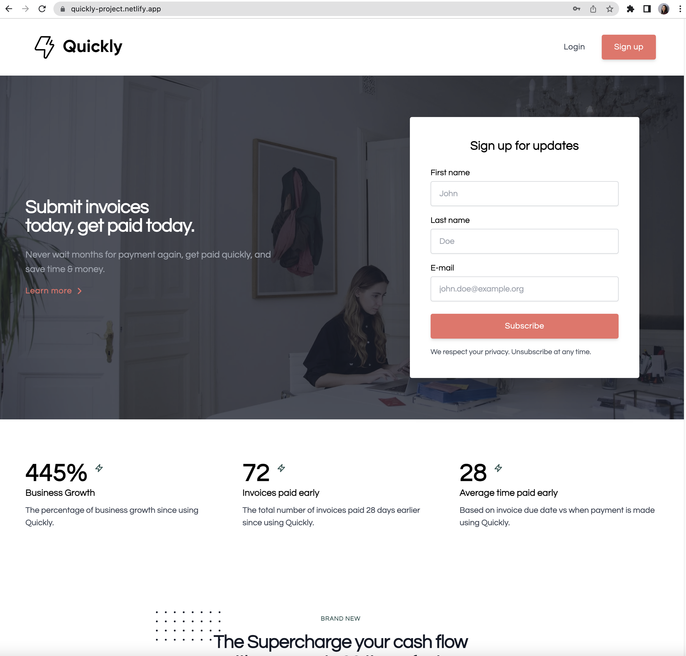
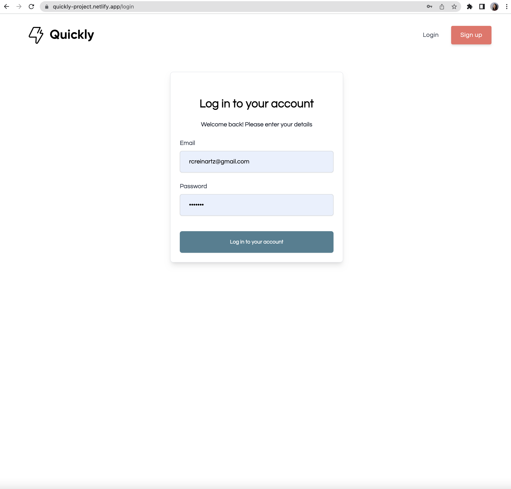
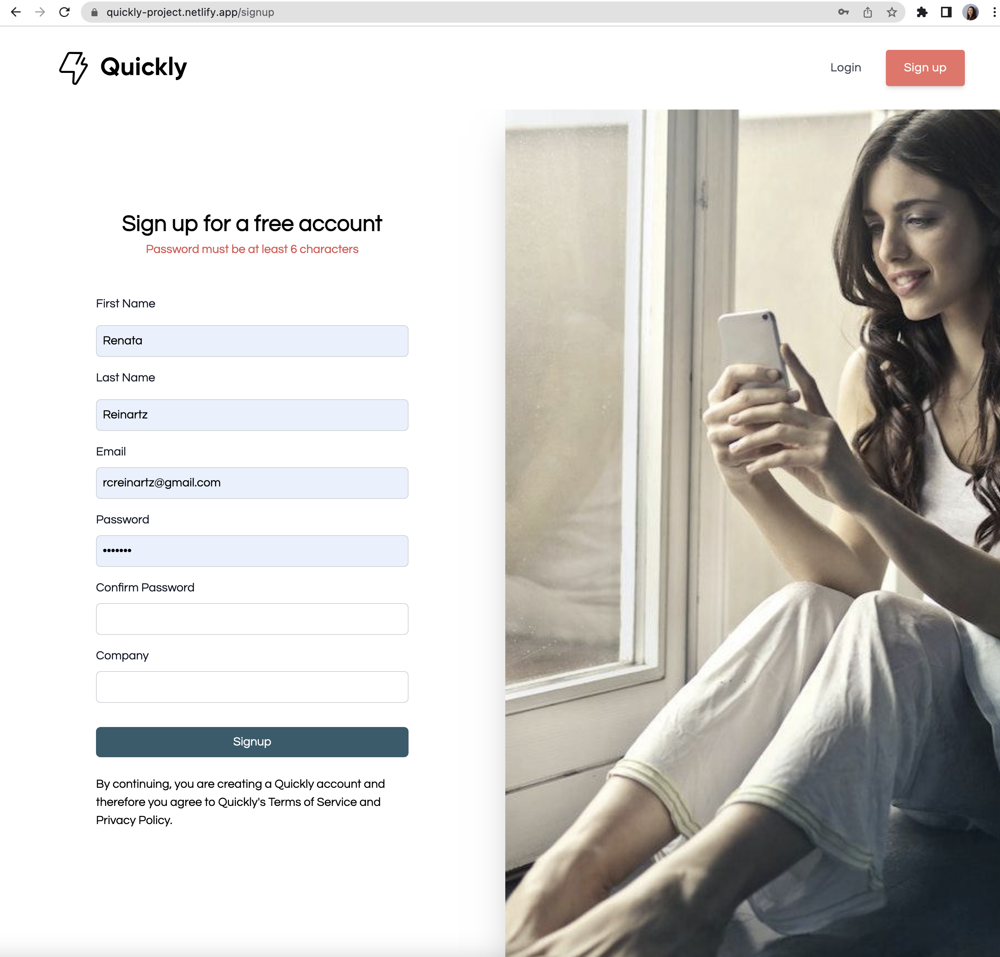

# Quickly-project
Quickly: SuperCharge Your Cash Flow!
LIVE LINK: (https://quickly-project.netlify.app/)

# About
Welcome to Quickly - Project, this is a React application that integrates with the Quickly Auth Microservice to provide authentication functionality. The app consists of three pages: Login, Signup, and My Profile. It utilizes React Router for navigation between these pages and Axios for making HTTP requests to the Quickly Auth Microservice.

Quickly - Project was built by Renata Reinartz

# Requirements
Node.js (version >= 12.0.0)
NPM (version >= 6.0.0)

# Pages/Views

The Login page provides a form for users to enter their email and password. The email input is validated to ensure it is a valid email address. Upon submission, the form makes a request to the Quickly Auth Microservice to authenticate the user.

The Signup page displays a form where users can enter their first name, last name, email, and password. The form includes email and password confirmation fields, and the form will only submit if the email and password confirmations match. Passwords are validated to ensure they have a length of 6 or more characters. Upon submission, the form sends a request to the Quickly Auth Microservice to create a new user.

The My Profile page displays the user's information when they are logged in. If the user is not logged in (authenticated), a "401 Unauthorized" page is shown. The application stores the authentication state either in local storage or in the app store to keep track of the user's login status.

# Testing
Unit tests have been written for each component using the Jest testing framework. These tests ensure that each component mounts without errors. 
This application utilizes Tailwind as the chosen style framework. The components are styled using Tailwind classes and CSS. Feel free to customize the styling as per your requirements.

Dependencies
axios: ^1.4.0
next: ^13.4.7
react: ^18.2.0
react-dom: ^18.2.0
react-icons: ^4.10.1
tailwind: ^3.3.2

Contributing
Contributions are welcome! If you find any issues or have suggestions for improvements, please submit a pull request or open an issue on the GitHub repository.

License
This project is licensed under the MIT License.

## Screenshots

<table>
  <tr>
    <td></td>
    <td></td>
    <td></td>
   </tr>
</table>

